<h1 align="center">Hi, I'm Tangjiaxin 👋</h1>

  <em>自由开发者 | C • Rust • Zig • Qt • Linux • Godot</em>

  
  

## 🚀 About
- 自由开发者
- 会学习各种开源项目，对计算机有兴趣
- Linux用户

## 🧩 Tech Stack + Languages

  

  Made with ❤️ by Wang Xu

